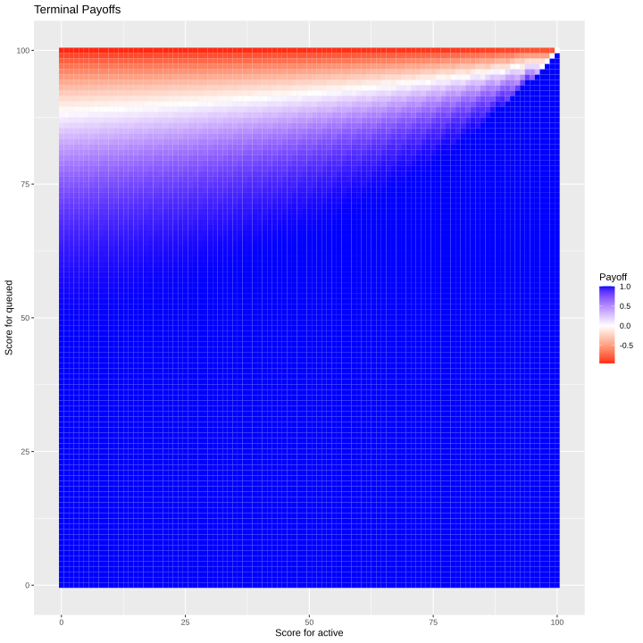
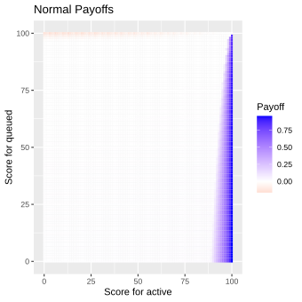
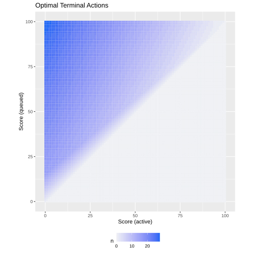
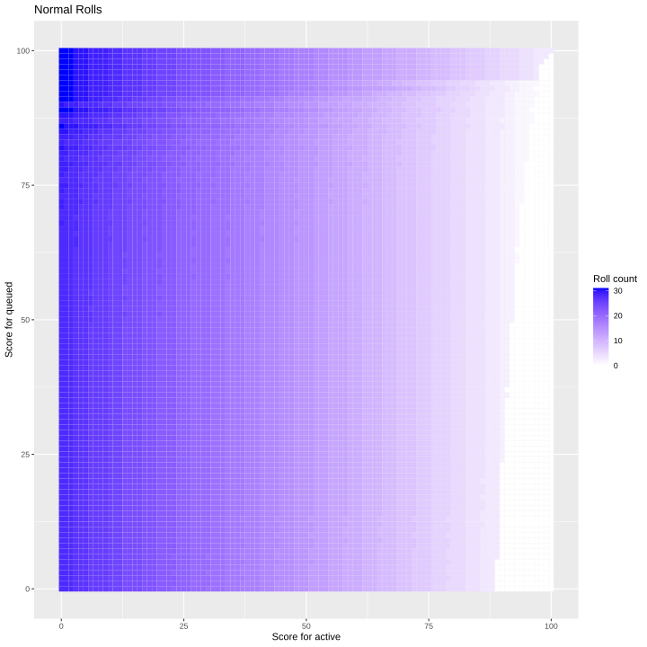

# Greed—Optimal Policy Solver

## Background

Greed is a dice-based two-player game where players try to get as close to the maximum score as possible without going bust. The player whose score is higher at the end of play wins. This project implements a dynamic programming solution to determine the optimal policy for any game state.

## Game Rules

In this game, players alternate turns, choosing to roll as many dice as they like. Each die is numbered from 1 to n, typically 6. The total rolled on a turn is added to that player's score. However, if a player's score ever exceeds the maximum threshold, typically 100, they bust and immediately lose the game.

Play continues back and forth until one player decides to roll 0 dice, signaling the beginning of the last round. The opposing player then has one final opportunity to roll, following the same rules. Once this last turn is completed, the game ends. The player with the higher score wins; if both players have the same score, the game is declared a draw.

## Project Structure

- `/play`: Contains the code to play a game of Greed.
- `/solve`: Contains the code to calculate the optimal policy and generate CSV data.
- `/visualize`: Contains scripts to create visualizations from the CSV data.
- `/paper`: Documents the mathematical theory and algorithms used.

## Usage

### Playing

```sh
cd play
cargo run --release -- --max=100 --sides=6
```

```
██████╗ ██████╗ ███████╗███████╗██████╗
██╔════╝ ██╔══██╗██╔════╝██╔════╝██╔══██╗
██║  ███╗██████╔╝█████╗  █████╗  ██║  ██║
██║   ██║██╔══██╗██╔══╝  ██╔══╝  ██║  ██║
╚██████╔╝██║  ██║███████╗███████╗██████╔╝
╚═════╝ ╚═╝  ╚═╝╚══════╝╚══════╝╚═════╝
       max score: 100, sides: 6

round 0: P1: 0, P2: 0
P1 rolls: 35

round 1: P2: 0, P1: 99
P2 rolls: 35

round 2: P1: 99, P2: 94
P1 rolls: 0

round 3: P2: 94, P1: 99 [FINAL]
P2 rolls: 1

=========================================
             final results
=========================================
P1: 99, P2: 99
P1 and P2 tie!
```

### Solving

```sh
cd solve
# generates csv file `greed_[max]_[sides].csv`
cargo run --release -- --max=100 --sides=6 --format=csv
# generates a (mostly) human readable report
cargo run --release -- --max=100 --sides=6 --format=stdout
```

### Visualizing

```sh
cd visualize
# generates svg files from the csv file:
# - `terminal_n.svg`
# - `terminal_payoffs.svg`
# - `normal_n.svg`
# - `normal_payoffs.svg`
julia visualize.jl ../results/greed_100_6.csv
```

| | **Terminal** | **Normal** |
|-|--------------|------------|
| **Payoff** |  |  |
| **n** |  |  |


## Key Findings

- **The first player has a slight advantage**: The first player has a slight advantage at the start of the game, but luck will subsume any advantage that they may initially have.
- **Stopping early is risky**: Even when ahead, halting before reaching ~80–90 points gives the opponent a significant chance to catch up in a single roll.
